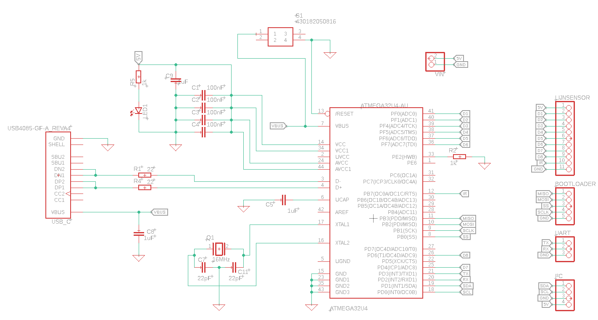
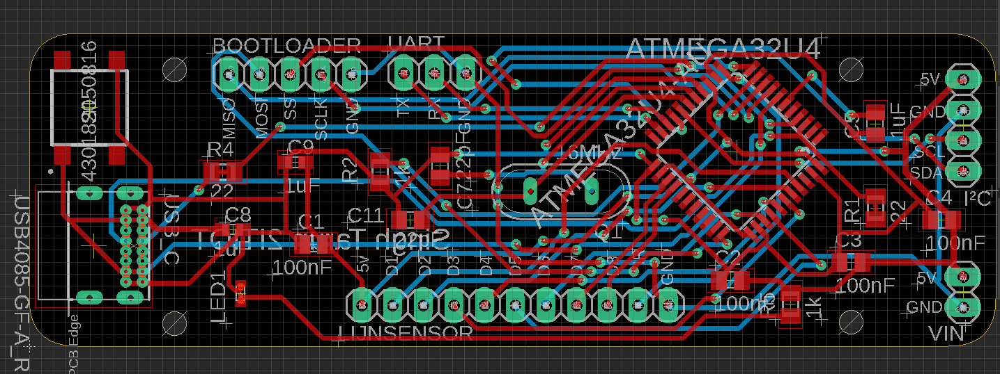
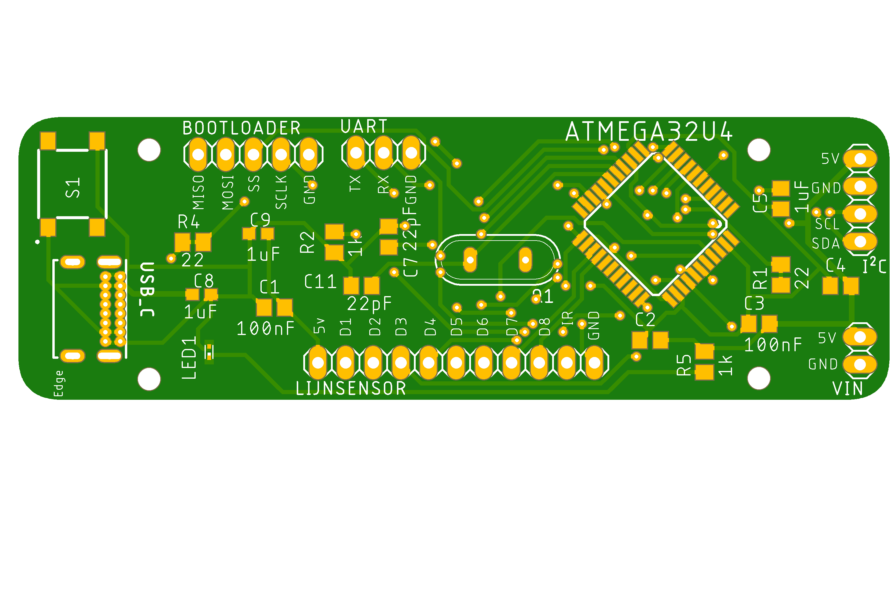
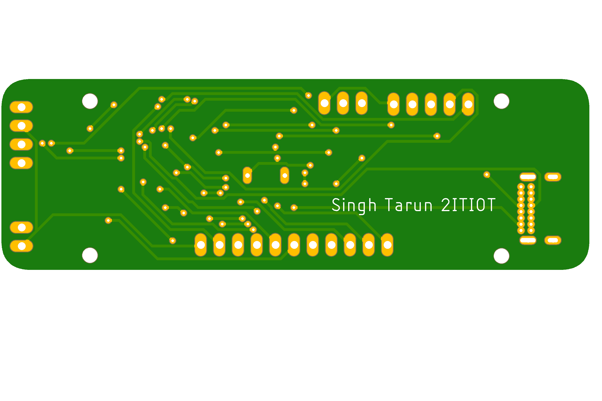
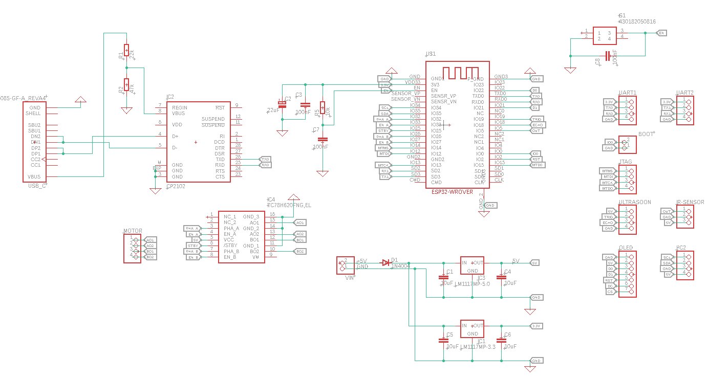
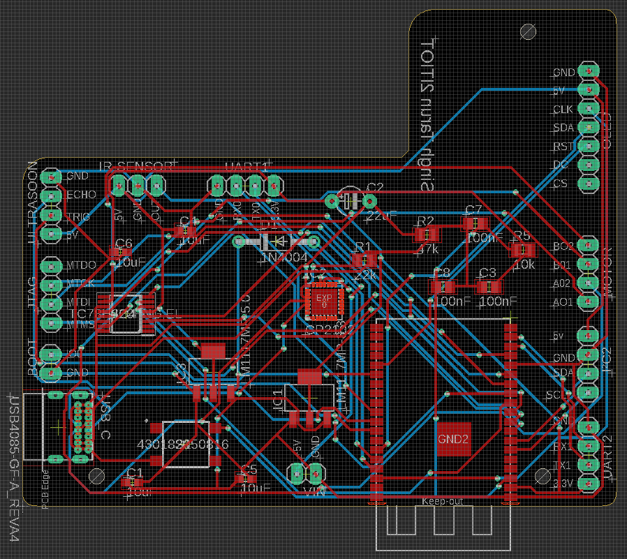
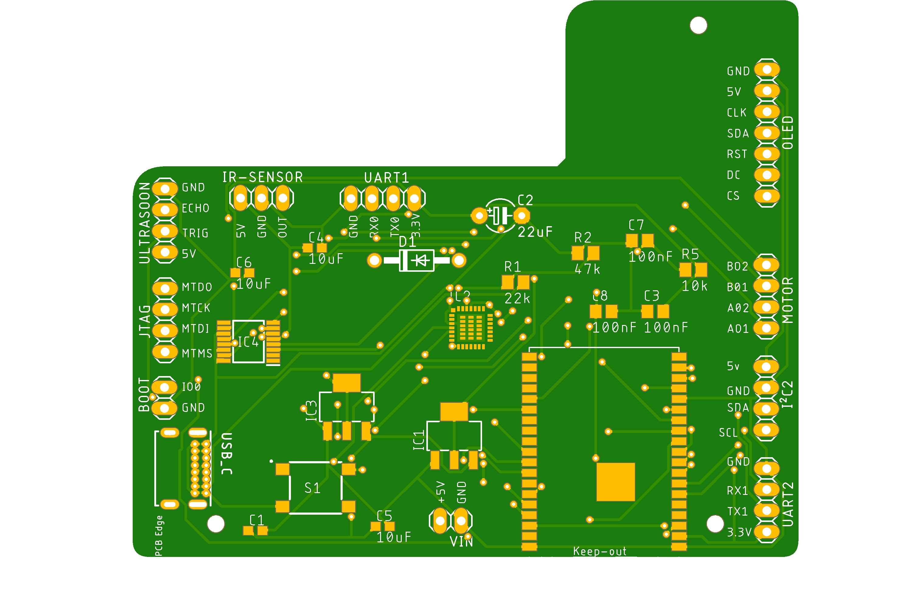

# PCB designs

## Linetrackerboard versie 1

Hieronder vindt u de schema en de pcb design van de linetrackerbordje.

### schema 

### pcb

### 3D design

## Motorsturing versie 1

Hieronder vindt u de schema en de pcb design van de motorsturing.

### schema 

### pcb

### 3D design

