# PCB designs

## Linetrackerboard

### Versie 1

Hieronder vindt u de schema en de pcb design van de linetrackerbordje.

#### schema 

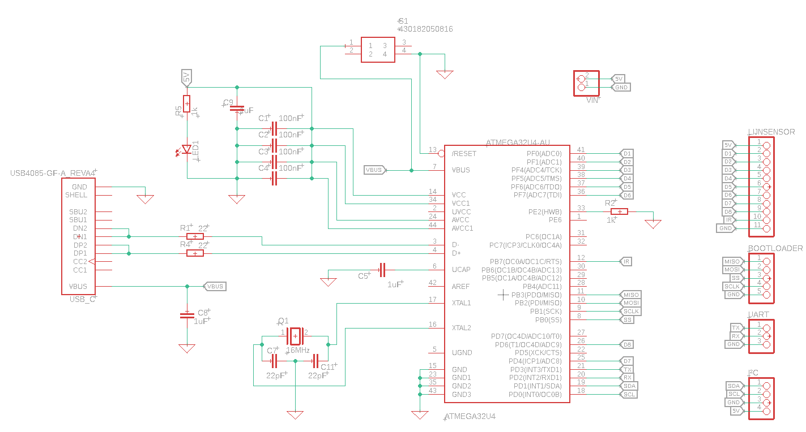

#### pcb

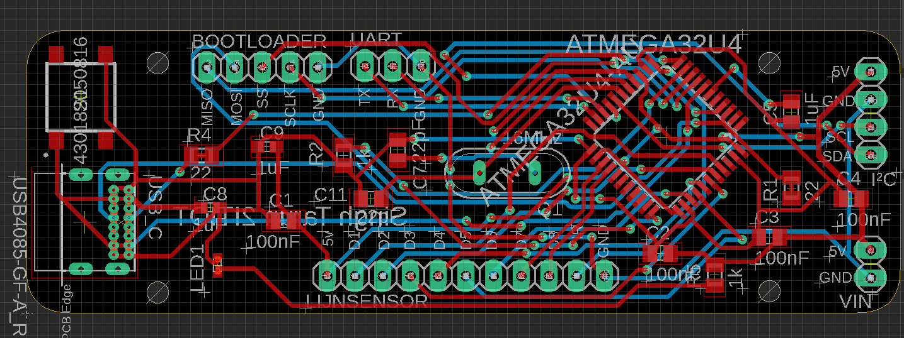

#### 3D design

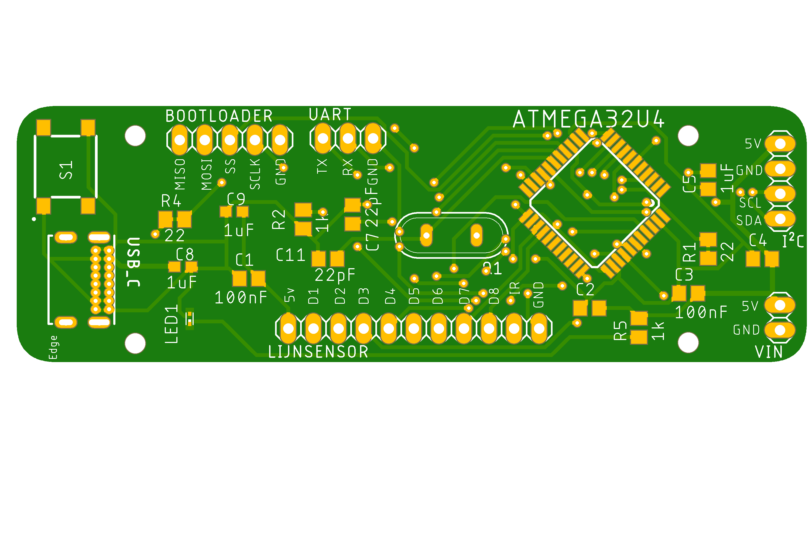

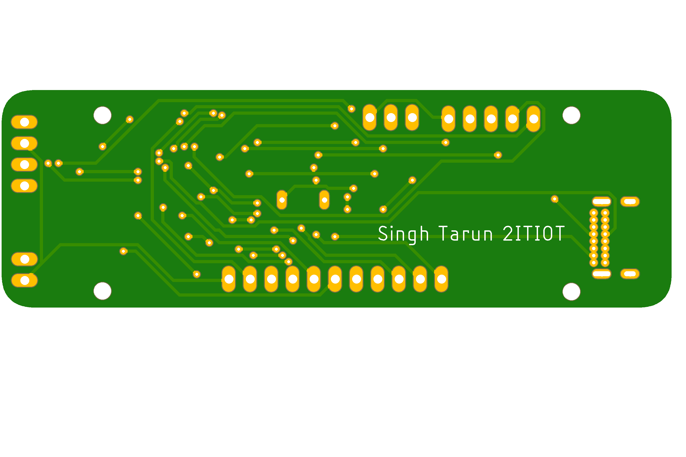

### Versie 2

Hieronder vindt u de schema en de pcb design van de linetrackerbordje.

#### schema 

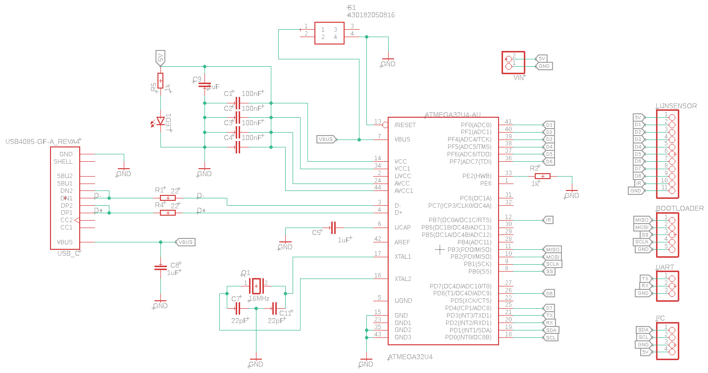

#### pcb

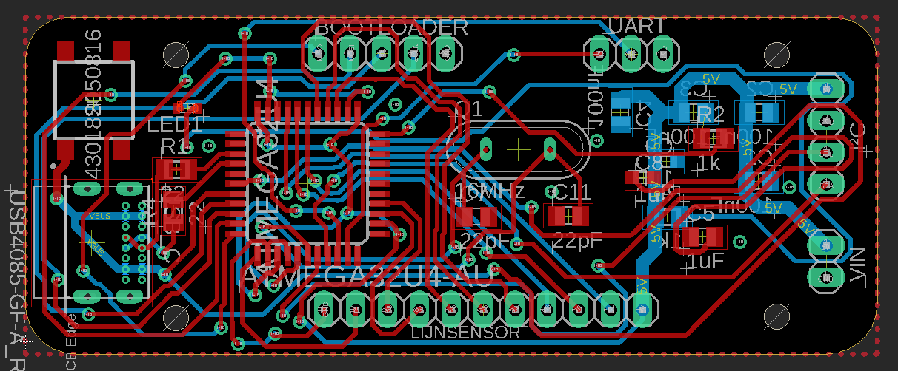

#### 3D design

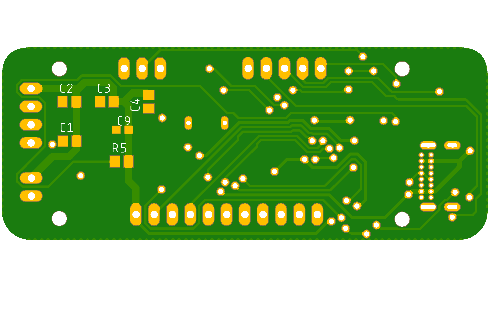

## Motorsturing

### versie 1

Hieronder vindt u de schema en de pcb design van de motorsturing.

#### schema 

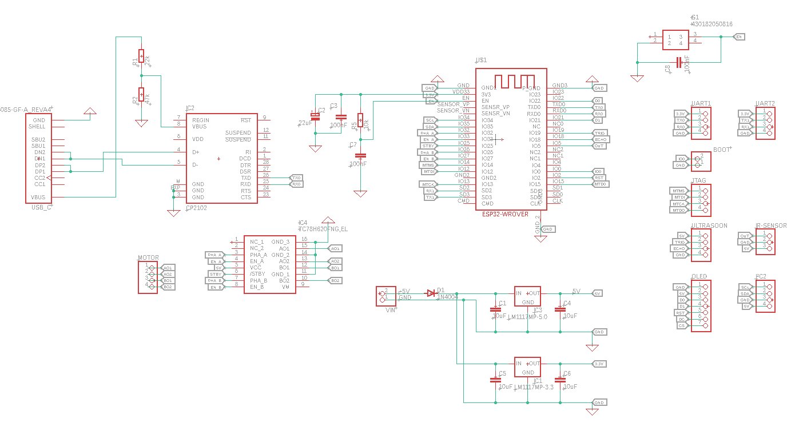

#### pcb

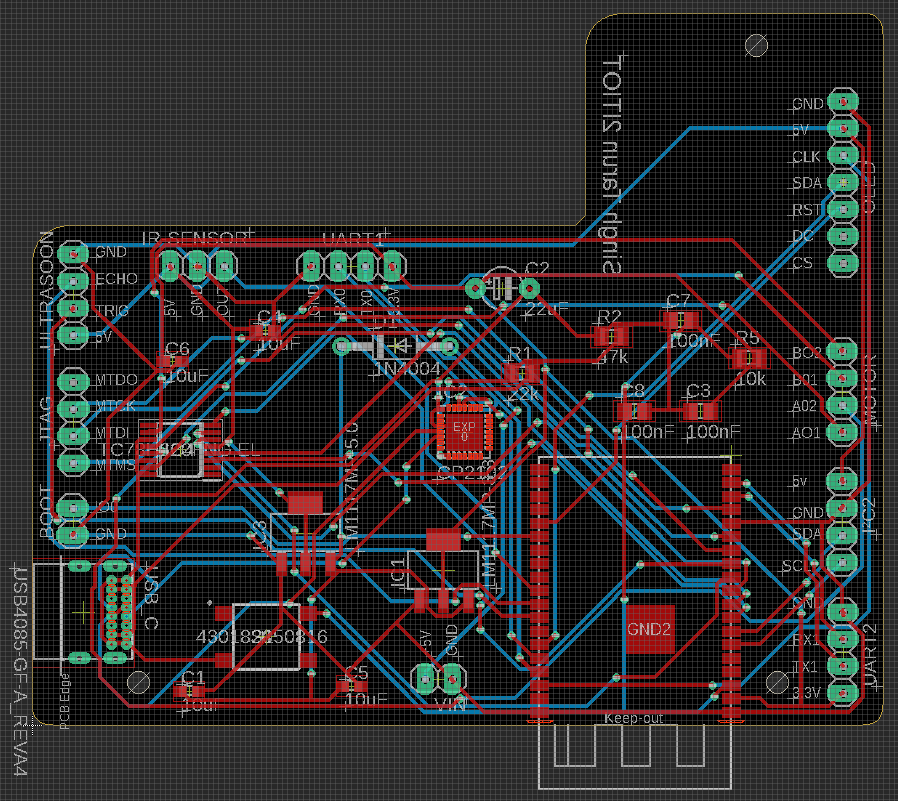

#### 3D design

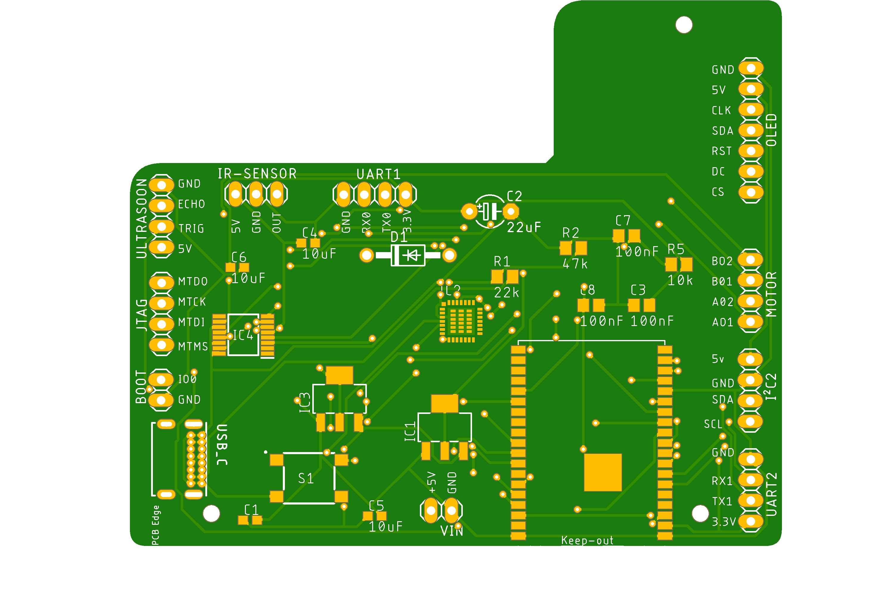

### versie 2

Hieronder vindt u de schema en de pcb design van de motorsturing.

#### schema 

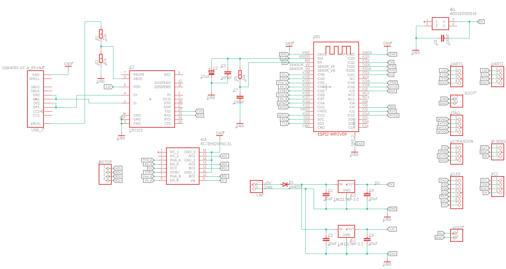

#### pcb

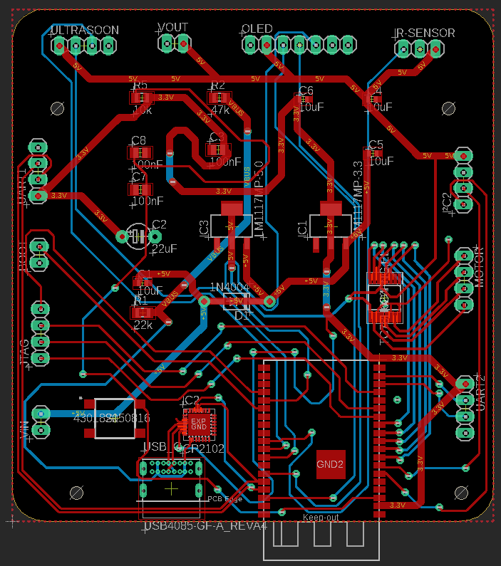

#### 3D design

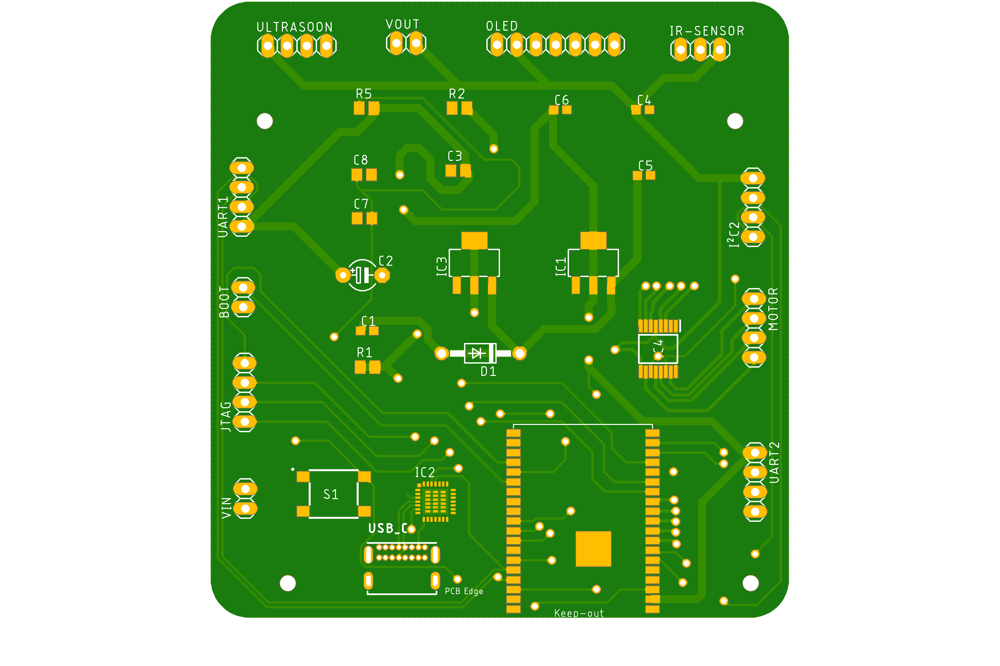

