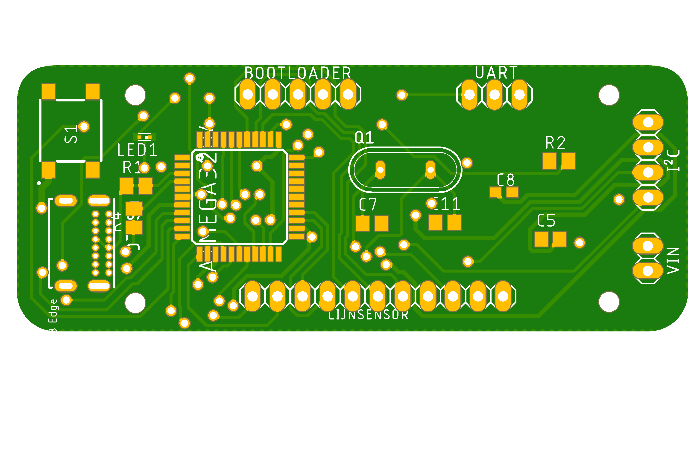

# PCB designs

## Linetrackerboard

### Versie 1

Hieronder vindt u de schema en de pcb design van de linetrackerbordje.

#### schema 

#### pcb

#### 3D design

### Versie 2

Hieronder vindt u de schema en de pcb design van de linetrackerbordje.

#### schema 

#### pcb

#### 3D design

## Motorsturing

### versie 1

Hieronder vindt u de schema en de pcb design van de motorsturing.

#### schema 

#### pcb

#### 3D design

### versie 2

Hieronder vindt u de schema en de pcb design van de motorsturing.

#### schema 

#### pcb

#### 3D design

